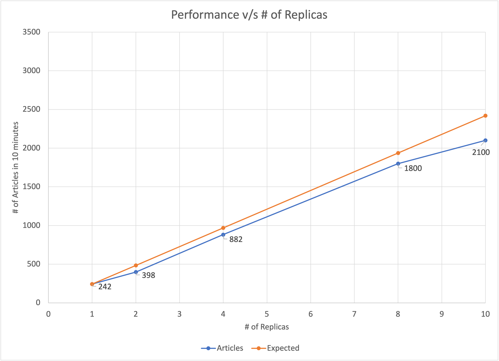

# Wikipedia Scraper

This scraper scrapes Wikipedia pages and for each page, it finds all related topics that are brought up in the opening paragraph. The data then gets stored in a cloud MongoDB database. This sort of data could be used to build an assosciation graph / collect data for NLP work. In practice, it is impractical to use this scraper to scrape all of Wikipedia, but could be used to find related topics by choosing an appropriate bank of starting topics.

The main purpose of this project is that it implements a useful DevOps infrastructure. The application is Dockerized and published to [DockerHub](https://hub.docker.com/repository/docker/vsingh18567/cis188-scraper). There is also a K8s manifest written that allows the scraper to be distributed so that Wikipedia pages can be scraped in parallel using replicas of the Docker image. The parallelization is possible because there is a decentralized table of "tasks" (i.e. urls to follow up on) that each pod can query to find the next page to scrape, and then iteratively add subsequent links to the task table. This K8s manifest has been deployed to AWS EKS. 

The ideal number of replicas seems to be 8, after which performance does not seem to improve. 

This is the final project for CIS 188 - DevOps. 